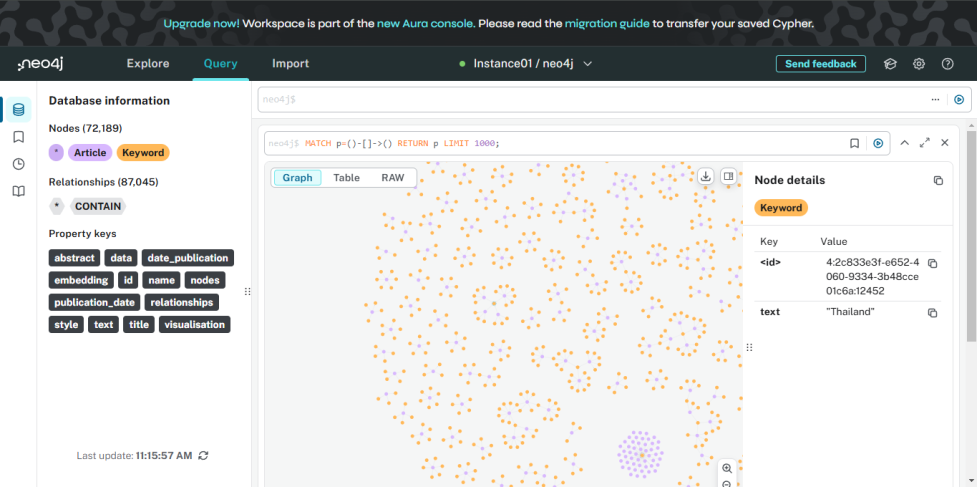

# RAG with Mistral

## Description:
Chat with **Mistral-7B-Instruct** using context retrieved from a **Neo4j** vector index. This app allows you to ask questions, and the assistant will provide real-time, context-driven answers by querying relevant articles and their keywords from the Neo4j database.



## Key Features:
- **Real-time context search** from a Neo4j vector index.
- **Integration with Mistral-7B-Instruct model** for natural language processing.
- **Keyword extraction** from relevant articles for enhanced context-based responses.

## App:
[HuggingFace Space](https://huggingface.co/spaces/Adventure123/Chatbot-Intro-DSDE)


## Installation:

1. Clone the repository:
    ```bash
    git clone https://github.com/VeerapatSintupong123/RAG-Mistral.git
    cd RAG-Mistral
    ```

2. Set up environment variables for your API tokens and Neo4j credentials:
    ```bash
    export HUGGINGFACE_API_TOKEN="your_huggingface_api_token"
    export NEO4J_URI="your_neo4j_uri"
    export NEO4J_USERNAME="your_neo4j_username"
    export NEO4J_PASSWORD="your_neo4j_password"
    ```

3. Install the necessary Python dependencies:
    ```bash
    pip install -r requirements.txt
    ```

4. Run the app:
    ```bash
    streamlit run app.py
    ```

## Usage:
Once the app is running, you can interact with it by typing your queries in the input field. The assistant will return context-driven answers based on the articles and keywords from the Neo4j database.

**You can use custom data for experimentation by placing it in the 'experiment' folder.**
